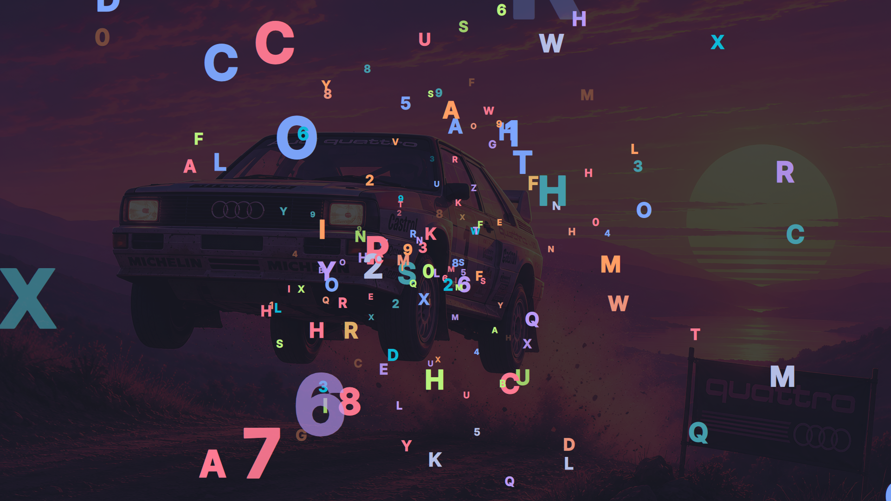

# Omasmash



**Beautiful, theme-aware keyboard smash with a real lock screen underneath.**

Every keypress paints a big letter in your active theme's colours, every click
splashes, every drag trails — and the machine underneath stays untouchable.

Little fingers can't reach your agents — and neither can you, on the tenth
*"fix it, and don't make any mistakes."*

> **Status: pre-alpha.** The session-lock premise test passes
> (`docs/premise-test.md`), but the passphrase and corner-hold unlock paths
> have not been tested with real input yet. Read [RECOVERY](#recovery) before
> you run it — all of it.

## Why this isn't a web page

The existing smash toys are browser based, and **a browser tab cannot hold the
input.** Escape, or any of a dozen key combos, drops fullscreen — and now the
keyboard is pointed at your email. Even BabySmash, the 2008 Windows original,
could only block input on a best-effort basis from inside a normal app.

Omasmash is built on `ext-session-lock-v1`, the Wayland session-lock protocol —
the same mechanism behind Omarchy's real lock screen. Input exclusivity is
enforced by the compositor, not by a focus grab. While it is up, nothing else
on the system receives keyboard or pointer input. No Escape, no Alt-Tab, no
alt-clicking the window away.

So: **Omasmash is a lock screen that plays instead of asking for a password.**

## What it looks like


It opens by flying the camera through a corridor of letters, hits, and drops
you into the play surface. Everything is painted from your active theme.

## Theming

Colours come from your active theme, live. Omasmash reads
`~/.local/state/omarchy/current/theme/colors.toml` directly rather than going
through the shell's `Color` singleton, because that singleton only exposes
five roles and a play surface wants the whole crayon box. Your wallpaper is
drawn behind the play surface, dimmed, so it still reads as *your* desktop.

Switch themes and it follows — the palette is re-read when
`current/theme.name` changes.

## Starting it

`bin/omasmash-toggle` is the command to bind a hotkey to — it locks if
unlocked and unlocks if locked, so one chord does both.

**No keybinding is installed by this project.** Binding a chord that locks
your session is your call; see [`docs/hotkey.md`](docs/hotkey.md) for the
suggested bind and how to pick a chord a toddler cannot reach.

## Unlocking

Three ways out, in order of everyday usefulness:

1. **Type the passphrase** — `omarchy` by default. Seven characters in
   sequence is effectively unreachable by random smashing. Nothing is
   displayed while you type.
2. **Hold the top-left corner** for three seconds. A thin accent-coloured bar
   fills to show progress. Discoverable for an adult, impossible while
   flailing.
3. **Type your real password and press Enter.** There is no visible field —
   keystrokes accumulate invisibly and Enter submits them to PAM. This always
   works, even if you changed the passphrase and forgot it. Safe to use in
   front of people: nothing you type is ever displayed
   (see [why](docs/security.md)).

## This is a child lock, not a security lock

Say it plainly: the passphrase is a *known string*. It stops a toddler, and it
stops you from doing damage while you smash. It does not stop a person with
physical access to your machine, and it is not a substitute for
`omarchy.lock`. Do not walk away from an unattended machine
with only Omasmash up and consider it locked.

## Hotkeys are blocked too

`ext-session-lock-v1` stops input reaching other *clients*, but Hyprland
resolves its own keybinds before delivery — so without more work `SUPER+Q`
and `SUPER+SHIFT+E` still fire through a lock screen, and a toddler can close
windows or kill your session through it.

Omasmash puts Hyprland into a **submap** while active, which makes every other
bind on the system inert. The submap carries exactly one chord:

```
SUPER + CTRL + ALT + SHIFT + Escape     # restores keybinds, then unlocks
```

Deliberately awkward, because it must never be reachable by a palm on the
keyboard — and because a process that dies holding the submap would otherwise
leave you a desktop with no shortcuts at all. The service also clears the
submap unconditionally on startup, since nothing else on the system will.

## Typed characters are never shown

Press `k` and you get some other letter, or a dinosaur. The glyph is random,
deliberately — it is what makes the password route above safe to use in a room
with other people in it. Full reasoning, and the one case for turning it off,
in [`docs/security.md`](docs/security.md).

Emoji also arrive on their own, at intervals that keep changing. A letter every
time is a machine; a letter every time *except* when a rocket shows up is worth
staying for.

## RECOVERY

`ext-session-lock-v1` gives the compositor the last word: **if the locking
client dies while the lock is held, the screen stays locked.** That is the
protocol working as designed — it is what stops someone unlocking your machine
by crashing your lock screen — but for a toy it is a genuine risk of locking
yourself out. Layers of defence, cheapest first:

**1. The paint watchdog (automatic).** The play surface drives a canary from
the render loop. If it stops advancing for two consecutive five-second
samples, the service concludes the surface has stopped painting and releases
the lock itself. This covers a wedged surface — it cannot cover a dead
process.

**2. Your PAM password**, typed on the play surface followed by Enter. Nothing
you type is displayed — see [`docs/security.md`](docs/security.md).

**3. IPC unlock, from another machine or an SSH session:**

```bash
~/Work/omarchy-omasmash/bin/omasmash unlock
```

Works whenever the process is alive and answering, including when the screen
is showing nothing useful.

**4. The TTY escape.** If the process is dead and the compositor is still
holding the lock:

```
Ctrl+Alt+F2          # switch to a text console
<log in>
pkill -f omasmash     # or: pkill quickshell
Ctrl+Alt+F1          # switch back
```

Omarchy's own stranded-lock handling then applies: a freshly started instance
detects a lock it did not take (via `omarchy-hyprland-session-locked`) and
adopts it, giving you a surface that can accept your PAM password.

**Verify you can get to a TTY on your machine before you run the first lock
test.** That is the floor under everything else here. On a systemd machine,
`Ctrl+Alt+F2` spawns a login on demand only if `autovt@.service` resolves to a
valid `getty@.service` and logind's `NAutoVTs` covers that VT — check both
rather than assuming.

### Prerequisite: `allow_session_lock_restore`

Recovery step 3 only works if Hyprland has
`misc:allow_session_lock_restore = true`. Omarchy sets this by default
(`default/hypr/looknfeel.lua`). **If you have turned it off, there is no
in-session recovery at all**: a new client trying to take over a stranded lock
is killed by the compositor with a fatal Wayland protocol error, and only a
TTY will get you back in. Verify with:

```bash
hyprctl getoption misc:allow_session_lock_restore
```

See `docs/premise-test.md` for the full reproduction.

### Known upstream issues this inherits

- Omarchy **#6888** — stranded-lock recovery never completes.
- Omarchy **#7478** — lock screen crash-loops roughly every 18s after DPMS-off.

Both are live against the session-lock path Omasmash is built on, and both are
part of the premise test's acceptance criteria.

## Installing

```bash
bin/omasmash-install
```

Puts a desktop entry and icon in your XDG directories and links the CLI onto
PATH, so **Omasmash** is searchable in the SUPER menu. It is not a webapp —
`omarchy-webapp-install` wraps a URL in a browser window, and this is a
Wayland session-lock client with no URL to wrap; the launcher entry is the
part that matters.

No hotkey is installed. See [`docs/hotkey.md`](docs/hotkey.md).

## Development

Runs as a standalone Quickshell instance, not an installed plugin — a crash
here cannot take your bar down with it, and restarts take about a second
instead of bouncing the whole shell.

```bash
bin/omasmash preview   # windowed visual preview -- no lock, no compositor
bin/omasmash full      # fullscreen preview -- still no lock, Escape quits
bin/omasmash run       # the real service (does NOT lock on its own)
bin/omasmash lock      # lock
bin/omasmash unlock    # release
bin/omasmash status    # JSON: lock state, theme, watchdog, hotkeys, PAM
```

Use the previews for anything visual — they hot-reload and cannot lock you
out. The nested compositor is only needed for changes to the lock lifecycle
itself.

**Run every lock, crash, and `kill -9` test inside the nested compositor**,
where a stranded lock strands a window instead of your machine:

```bash
bin/omasmash-nested          # nested Hyprland with Omasmash inside
bin/omasmash-nested --kill   # from the host, if it wedges
```

## Licence

MIT.
